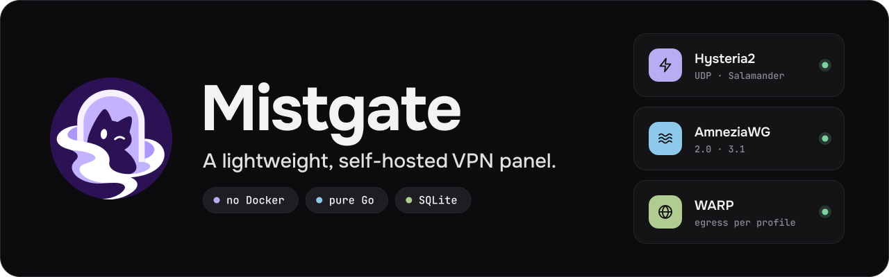

  <picture>
    <source media="(prefers-color-scheme: dark)" srcset="./assets/banner-dark.svg">
    <source media="(prefers-color-scheme: light)" srcset="./assets/banner-light.svg">
    
  </picture>

 

**Mistgate** is a lightweight, self-hosted panel for your own VPN fleet: one Go binary for the panel, one for the node agent, no Docker. Hysteria2 and AmneziaWG live side by side, in one subscription, in one admin UI.

> The source code is not public yet. The first repository will land in this organisation soon.

## Why another panel

- **Light.** SQLite, systemd, two static binaries. No Docker, no database server. The panel's memory target at idle is 80 MB (a target for now, not a benchmark).
- **AmneziaWG users are not a blind spot.** Every AmneziaWG device is a peer the panel knows about: who is online, traffic per user and per device.
- **A doctor that knows hosters.** Disk and journals filling up, a resolver that cannot resolve, clock drift, port conflicts, a sick network baseline. Found, explained in plain words, fixed with one confirmed click where that is safe.
- **Looked at from the client's side.** Synthetic probes connect the way a real client does (Hysteria2 today, more protocols next), so a node is green only if traffic really flows.
- **Made for AI agents too.** API tokens and an MCP server, with plan / apply and owner approvals for anything risky.

## What is inside

| The fleet | Access and tooling |
|:--|:--|
| &nbsp; **Hysteria2 and AmneziaWG** Hysteria2 with Salamander and AmneziaWG 2.0 / 3.1, userspace or kernel module. Several profiles per node. | &nbsp; **Subscriptions** Per-user links for Happ, Mihomo / Clash YAML, AmneziaVPN keys and `vpn://`, plus a public page with a QR code. |
| &nbsp; **WARP egress** Send a profile's traffic out through WARP. If the WARP link drops, the profile fails closed instead of leaking direct. | &nbsp; **Users and devices** Groups, one peer per device, traffic limits, DNS presets per user or group. |
| &nbsp; **Fleet doctor** Node self-checks with safe fixes, synthetic client probes, alerts with a full lifecycle. | &nbsp; **Admin UI** Russian and English, dark and light, passkey sign-in. |
| &nbsp; **Signed updates** Node agents check an ed25519-signed manifest themselves. Canary rollout, health gate, automatic rollback. | &nbsp; **Agent access** Tokens for read-only, operator and admin. Changes go through plan / apply; the risky ones wait for the owner. |

## Status

Mistgate is pre-release. What exists and what is coming:

| Stage | What |
|:--|:--|
| **Done** | Panel and node agent over mTLS · Hysteria2 · AmneziaWG 2.0 / 3.1 · WARP egress · subscriptions and the public user page · DNS presets · health doctor, synthetic probes, alerts · signed node-agent updates with canary and rollback · API tokens and MCP server · admin UI in ru / en |
| **Now** | Node provisioning over SSH from the UI, with preflight checks · encrypted vault for server passwords · encrypted panel backups to R2 |
| **Next** | Telegram bot for the whole fleet · more subscription formats (Xray JSON, sing-box) and subscription mirrors · panel self-update · documentation in ru / en and a one-line installer |
| **Later** | VLESS REALITY as the first external protocol plugin |

## Русский

**Mistgate** — лёгкая панель для собственного VPN: один бинарь панели, один бинарь агента ноды, без Docker, на SQLite. Hysteria2 и AmneziaWG 2.0 / 3.1 работают в одной подписке: пользователи Happ, Mihomo и AmneziaVPN видны в одной панели, вместе с трафиком по пользователям и устройствам.

- «Доктор флота» находит проблемы хостера и ноды (диск и журналы, резолвер, время, занятые порты) и объясняет их по-русски; безопасные исправления делаются одной кнопкой.
- Синтетические проверки подключаются как настоящий клиент (пока через Hysteria2), поэтому нода «зелёная» только если трафик реально идёт.
- Обновления агента подписаны и откатываются сами; для AI-агентов есть токены и MCP-сервер с подтверждением опасных действий.
- Интерфейс на русском и английском.

Код пока не опубликован, первый репозиторий появится здесь.

---

Open source. The license will be announced with the first release.
